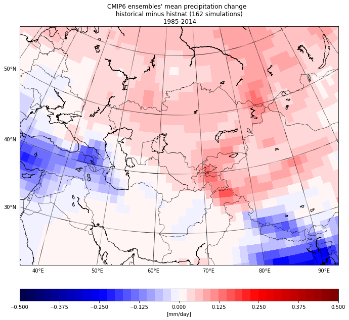
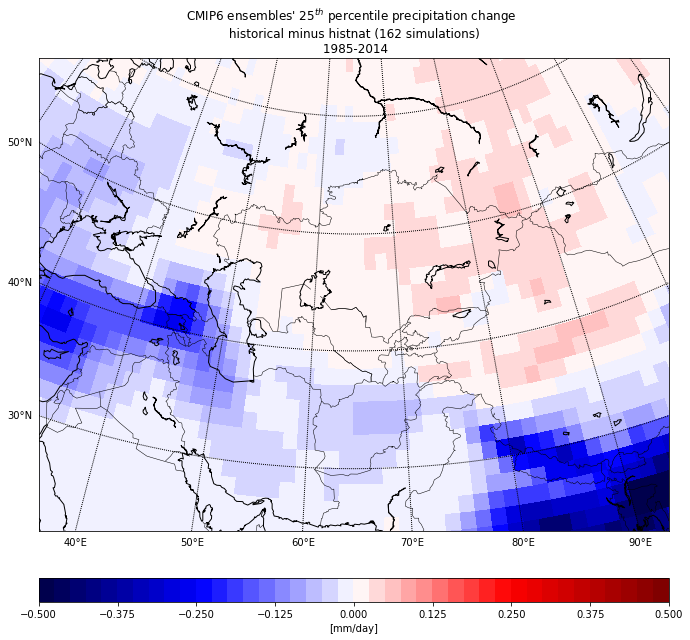
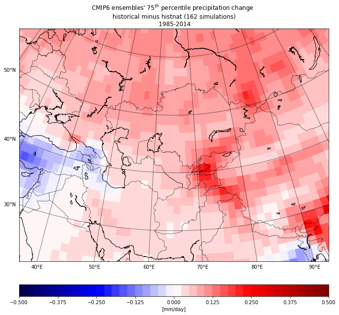

# Anthropogenic influence on precipitation in Central Asia

<table>
  <tr>
      <td> </td>
      <td>CMIP6 ensemble mean (mm/day)</td>
      <td>CMIP6 ensembles' 25th percentile (mm/day)</td>
      <td>CMIP6 ensembles' 75th percentile(mm/day)</td>
  </tr>
  <tr>
      <td> </td>
      <td></td>
      <td></td>
      <td></td>
      
  </tr>
 </table>
